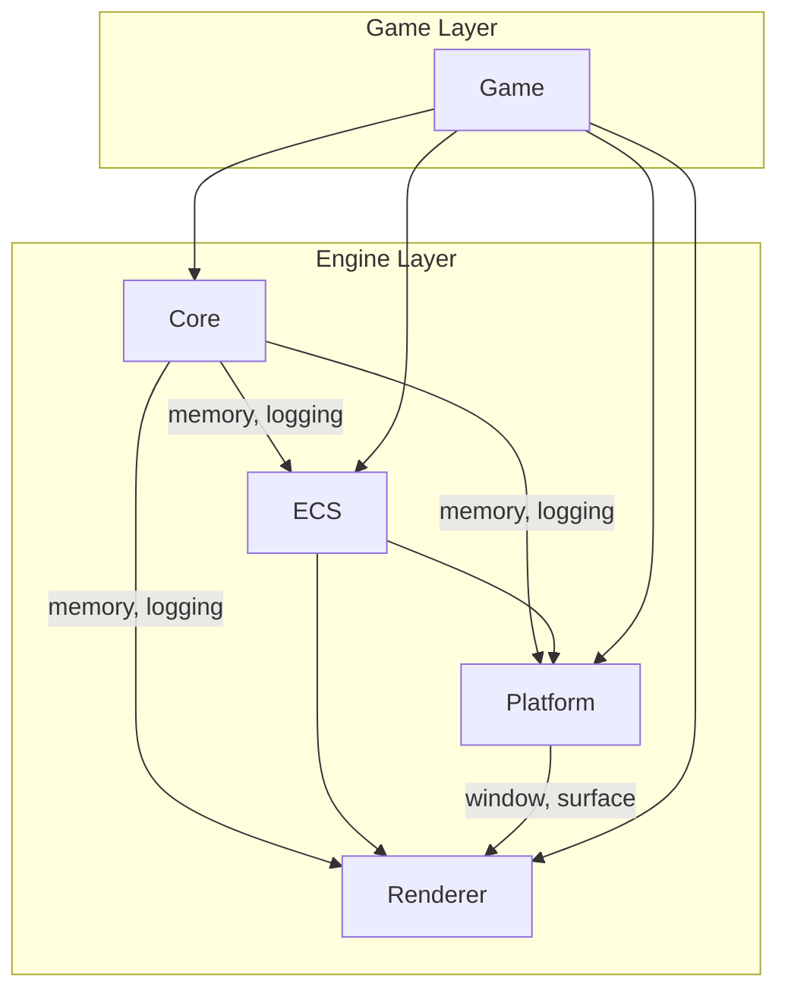
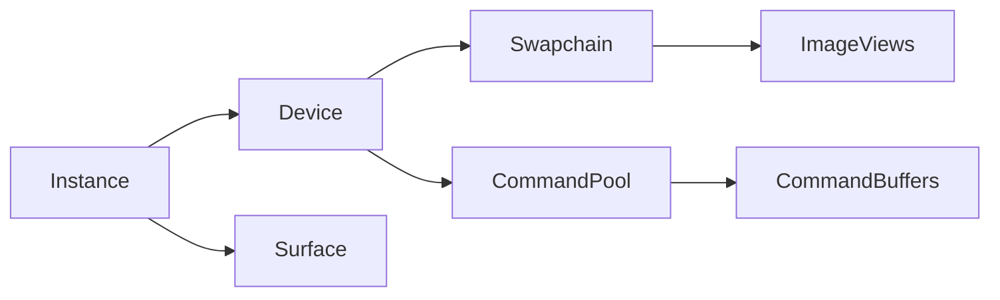

# Horizon Engine Architecture

## Overview

Horizon Engine is a 3D FPS game engine built with modern C++20, emphasizing performance, safety, determinism, and testability.

## Module Dependency Graph



## Core Principles

### 1. RAII Everywhere

All Vulkan objects are managed through move-only RAII wrappers:

```cpp
class VulkanDevice {
    VkDevice m_device{VK_NULL_HANDLE};
public:
    ~VulkanDevice() {
        if (m_device) vkDestroyDevice(m_device, nullptr);
    }
    VulkanDevice(VulkanDevice&&) noexcept = default;
    VulkanDevice(const VulkanDevice&) = delete;
};
```

### 2. PMR Memory Model

All engine containers use `std::pmr`:

| Domain   | Allocator   | Lifetime          |
| -------- | ----------- | ----------------- |
| Frame    | LinearArena | Single frame      |
| ECS      | Pool        | Entity lifetime   |
| Renderer | Pool        | Resource lifetime |
| Assets   | General     | Until unloaded    |

### 3. Pure ECS

```
Entity = u32 index + u32 generation
Component = Plain data struct
System = Logic operating on components
World = Container for all ECS state
```

### 4. Fixed Timestep

```
while (running) {
    input();

    accumulator += frame_time;
    while (accumulator >= FIXED_DT) {
        tick(FIXED_DT);  // Deterministic
        accumulator -= FIXED_DT;
    }

    render(accumulator / FIXED_DT);  // Interpolation alpha
}
```

## Frame Lifecycle

1. **Input Phase** - Poll window events, update input state
2. **Update Phase** - Fixed timestep simulation (may run 0+ times)
3. **Render Phase** - Submit GPU commands, present

## Vulkan Lifetime Model



All Vulkan objects destroyed in reverse order of creation.

## Testing Strategy

- **Unit Tests**: ECS, memory, game loop (headless)
- **Integration Tests**: Renderer initialization
- **Determinism Tests**: Fixed timestep verification

Run tests: `ctest --output-on-failure`
