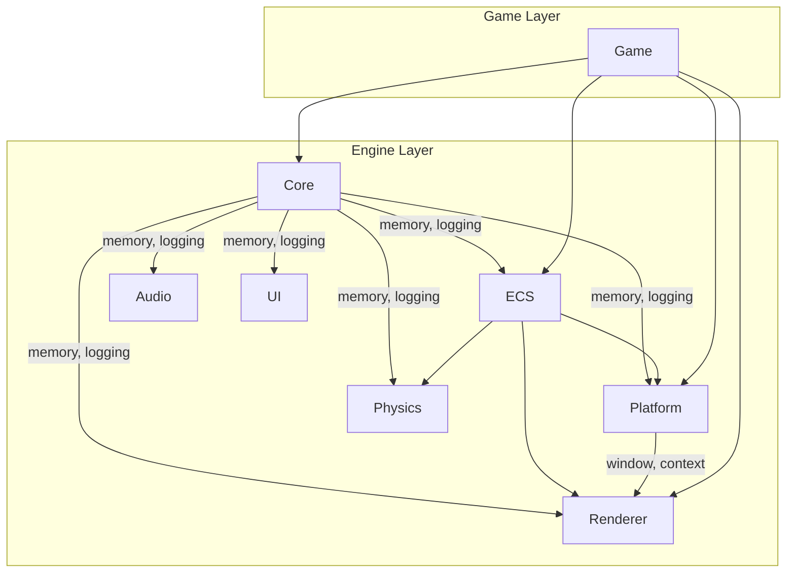

# Horizon Engine Architecture

## Overview

Horizon Engine is a 3D FPS game engine built with modern C++20, emphasizing performance, safety, determinism, and testability.

## Module Dependency Graph



## Core Principles

### 1. RHI Abstraction

The engine uses a **Render Hardware Interface (RHI)** to abstract the graphics API (Vulkan). All GPU resources are managed through RAII-compliant handle wrappers:

```cpp
// Example: Creating a texture via RHI
auto texture = device.create_texture({
    .width = 1920,
    .height = 1080,
    .format = TextureFormat::RGBA8_UNORM,
    .usage = TextureUsage::Sampled | TextureUsage::Storage
});
```

### 2. PMR Memory Model

All engine containers use `std::pmr` for custom allocation strategies:

| Domain   | Allocator   | Lifetime          |
| -------- | ----------- | ----------------- |
| Frame    | LinearArena | Single frame      |
| ECS      | Pool        | Entity lifetime   |
| Command  | Pool        | CommandList scope |
| Assets   | General     | Until unloaded    |

### 3. Pure ECS

```
Entity = u32 index + u32 generation
Component = Plain data struct
System = Logic operating on components
World = Container for all ECS state
```

### 4. Fixed Timestep

```
while (running) {
    input();

    accumulator += frame_time;
    while (accumulator >= FIXED_DT) {
        tick(FIXED_DT);  // Deterministic
        accumulator -= FIXED_DT;
    }

    render(accumulator / FIXED_DT);  // Interpolation alpha
}
```

## Render Lifecycle

1. **Input Phase** - Poll window events, update input state
2. **Update Phase** - Fixed timestep simulation (Physics, Game Logic)
3. **Render Phase** - Clear, Draw Opaque, Draw Transparent, Draw UI, Swap Buffers

## Testing Strategy

- **Unit Tests**: ECS, memory, game loop (headless)
- **Integration Tests**: Renderer initialization
- **Determinism Tests**: Fixed timestep verification

Run tests: `ctest --output-on-failure`
